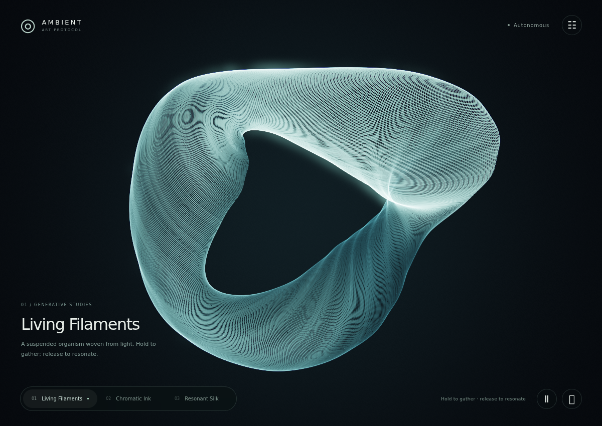
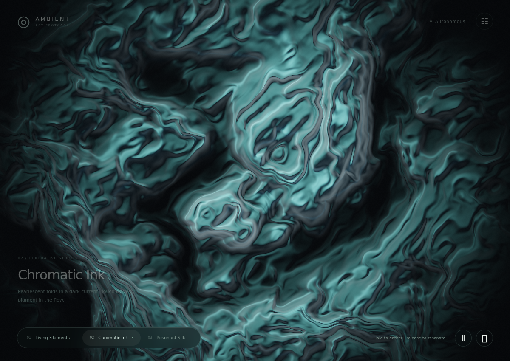
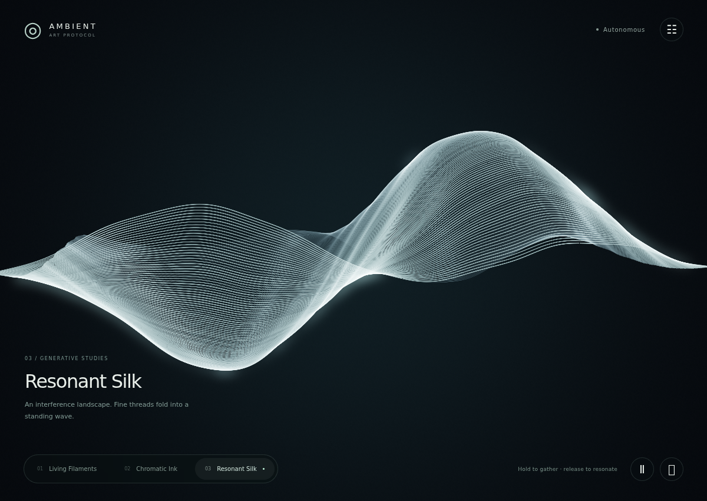
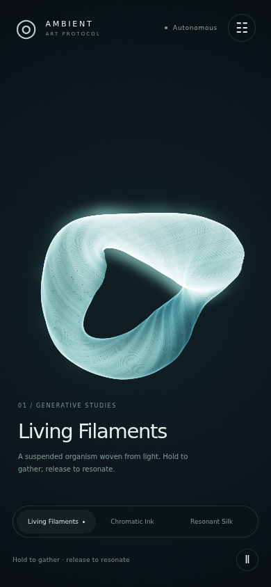

# TouchDesigner-inspired collection

The app opens into Living Filaments: a slowly deforming, suspended sculpture of luminous
strands. Chromatic Ink and Resonant Silk offer deliberately different material and motion
languages. The original themes remain in the advanced scene selector.

## Implemented

- Six-vertex instanced ribbon geometry on the existing WebGL2 renderer. Filaments and Silk
  each draw 57,600 segments at full detail or 19,200 at low detail. No per-frame CPU geometry
  allocation or new rendering framework.
- Curated Glacier, Ember, and Iris palettes; restrained bloom and aberration; aspect-aware
  framing; local hold/release deformation and signal-driven waves.
- Ink stores advected density in feedback alpha, independently from its shaded RGB output.
  Its surface normals come from procedural field gradients. It is not a physical fluid solver.
- Frozen outgoing-frame dissolves: only the incoming scene renders during a transition.
- Quality changes preserve shader history; target resizing resamples it. Context restoration
  recreates scene, geometry, post, and presentation resources.
- Defined smoothstep edges and time-scaled 8-bit feedback floor corrections in the legacy themes.
  Fluid's per-frame recoloring/compression are also scaled in time; numerical advection can still
  differ across timestep schedules.
- Theme defaults are restored on scene selection; an untouched slider no longer silently
  overrides every scene's look.
- Responsive gallery controls, focus-aware cinema mode, keyboard controls, source selection,
  pause, zero-motion speed, and an engine-level reduced-motion response.
- A separate art clock: source timestamps and the SDK protocol are unchanged.

## Deliberate architecture choices

The flagship uses deterministic analytic trajectories rather than a stateful GPU particle
solver. This creates stable connected filaments, supports seeking, and avoids float-position
texture requirements. It is a luminous ribbon sculpture, not a full particle-physics system.
The optional geometry pass extends ShaderManifest without forcing existing fragment themes
through a new framework. Add a simulation interface only when a concrete scene needs it.

Ribbons use additive emission with depth-dependent brightness, rather than opaque depth
occlusion. The resulting woven light is intentional. More physically accurate transparency,
segmented particle trails, a general render graph, and a GPU fluid solver remain separate
experiments rather than hidden prerequisites.

Local pointer attraction works in projected screen space so the response stays under the
finger. It is not a mesh raycast. Data-source pulses remain normalized canvas coordinates.

## Captures

These are actual Chromium WebGL renders, not generated concept images.






## Verify

```sh
pnpm install --frozen-lockfile
pnpm build
pnpm check
pnpm build:web
pnpm exec playwright install chromium
pnpm test:visual
```

The visual check launches its own loopback Vite server and controls requestAnimationFrame
for repeatable captures. It writes ignored artifacts to `artifacts/visual-check/`.
`CHROMIUM_PATH=/absolute/path/to/chromium pnpm test:visual` uses an existing browser.

It checks all six themes at two shader qualities in both HDR and forced 8-bit output (24
combinations), nonblack pixels, response to art controls and a pulse, GL errors, history
resizing, failed-shader fallback, and context loss/restoration. It also exercises the gallery,
portrait layout, palette controls, Escape, and pause/resize behavior.

The regular unit tests include 30/60/120 Hz clock equivalence, pause/resume, invalid deltas,
and reduced motion. The URL `?capture&scene=living-filaments&time=12` freezes shader time and
hides controls for art inspection; feedback history still evolves, so use the controlled browser
harness for regression captures.

Validation in this implementation used Linux Chromium with software WebGL. These checks
establish rendering correctness, not hardware frame-rate guarantees. Physical iPhone/Safari,
Android, thermal endurance, and subjective viewer testing still need validation before a
performance claim or broad release. Live third-party data feeds were not used by visual tests.
